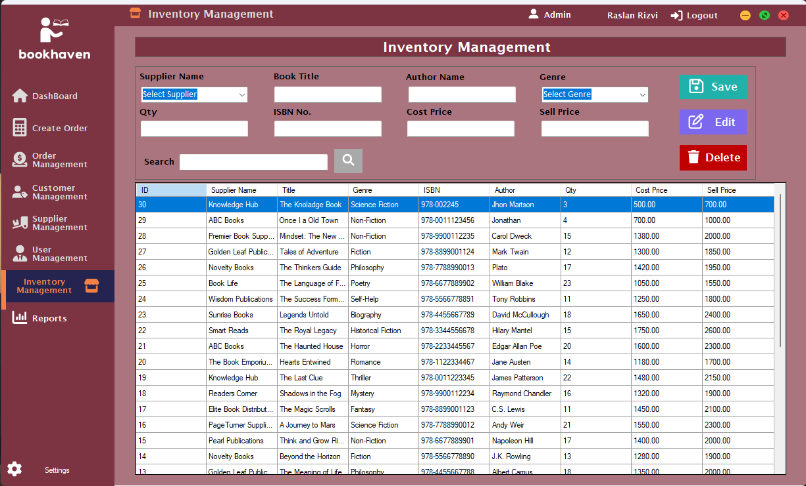

# Bookstore Management System

# BookHaven Fully Functional Desktop Application for Bookstore 

## Overview
BookHaven is a Windows Forms-based desktop application designed to streamline bookstore operations by efficiently managing inventory, sales transactions, customer details, and supplier information. This system enables bookstore staff to maintain accurate records and improve overall business workflow.

## Features
- **User Login System**
  - Secure authentication with role-based access control.
  - Admin and Sales Clerk roles with different levels of permissions.
  
- **Book Inventory Management**
  - Add, update, delete, and search books.
  - Book details include Title, Author, Genre, ISBN, Price, and Stock Quantity.
  
- **Customer Management**
  - Store customer details and purchase history.
  - Create and manage customer profiles.
  
- **Sales Transaction System**
  - Advanced Point-of-Sale (POS) module.
  - Automatic status updates based on payment status and order type.
  - Sales receipts generation.
  - Inventory updates after successful sales.
  
- **Order Management**
  - Track and manage customer orders.
  - Support for in-store pickup and delivery orders.
  
- **Supplier Management (Admin Only)**
  - Manage supplier details and contacts.
  - Generate purchase orders for inventory replenishment.
  
- **Admin Dashboard**
  - View sales metrics, inventory levels, and customer activity.
  - Manage users and modify business details.
  
- **Reporting & Analytics**
  - Generate daily, weekly, and monthly sales reports.
  - Track best-selling books and inventory status.
  
- **Security & Data Protection**
  - Role-based access control.
  - Secure storage of sensitive data using encryption.

## Technologies Used
- **Programming Language:** C#
- **Framework:** .NET Windows Forms
- **Database:** SQL Server
- **Development Environment:** Visual Studio

## Installation Guide
1. Clone the repository:
   ```sh
   git clone https://github.com/yourusername/BookHaven.git
   ```
2. Open the project in Visual Studio.
3. Configure the database connection in the application settings.
4. Build and run the application.

## Application Interface
### Login


### Admin Dashboard


### Book Inventory Management


### Sales Transaction


### Customer Management


### Reports


### Supplier Management


### User/Sales Clark Dashboard


## License
This project is open-source and available for use under the [MIT License](MIT-License-for-BookHaven.txt).

## Contact
For inquiries or contributions, please contact: 
- **LinkedIn** - [Raslan Rizvi](https://www.linkedin.com/in/raslanrizvi/)
- **Email:** [contact@raslanrizvi.me](mailto:contact@raslanrizvi.me)
- **GitHub:** [Raslan Rizvi](https://github.com/raslanrizvi)

---
Developed with ❤️ by [Raslan Rizvi](https://raslanrizvi.me)
